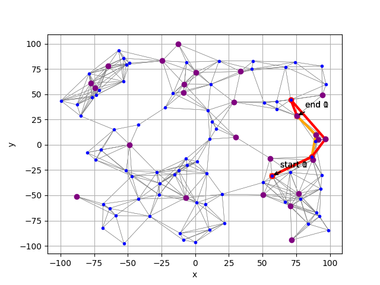
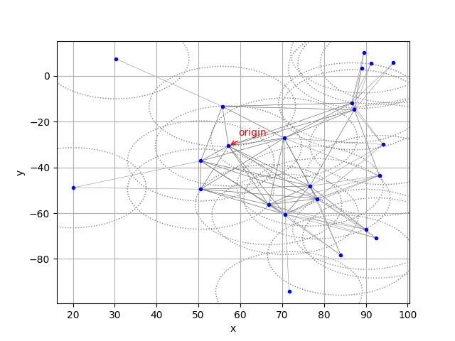

# hpc_asyncvalueiteration

This repositoriy is directly related to <a href='https://www.ei.tum.de/ldv/startseite/' target='_blank'>`Lehrstuhl für Datenverarbeitung`</a> course <a href='https://www.ei.tum.de/ldv/lehre/high-performance-computing-fuer-maschinelle-intelligenz/' target='_blank'>`High Performance Computing for machine intelligence`</a> at TU Munich. Goal of the course was to use parallelism in combination with C++ to speed-up different kinds of algorithms. First, algorithms were implemented using multiple threads on one single machine, later on - using <a href='https://www.openmp.org/' target='_blank'>`OpenMP`</a> and <a href='https://www.open-mpi.org/' target='_blank'>`OpenMPI`</a> - on mulitple machines."

<br/><br/>

-------

## Goal

Main goal of this repository is to connect Python and C++ by using <a href='https://cffi.readthedocs.io/en/latest/' target='_blank'>`CFFI`</a>. Using the simplicity of Python for importing data files and plotting the result in combination with C++ speed-up and parallelization provides the best performance for projects that contain a variety of `for` loops.

The here used example implements <a href='https://artint.info/2e/html/ArtInt2e.Ch9.S5.SS2.html' target='_blank'>`Asynchronous Value Iteration`</a> following the <a href='https://en.wikipedia.org/wiki/Dynamic_programming' target='_blank'>`Dynamic Programming`</a> principle. `Async VI` is widely used in the field of <a href='https://en.wikipedia.org/wiki/Reinforcement_learning' target='_blank'>`Reinforcement Learning`</a> (see also <a href='https://github.com/papstchaka/basic_ml/blob/master/library/reinforcement_learning.py' target='_blank'>`BasicML repositoriy`</a> for examples).

The here implemented algorithm is inspired by <a href='https://github.com/dennybritz/reinforcement-learning' target='_blank'>`Denny Britz's`</a> <a href='https://github.com/dennybritz/reinforcement-learning/blob/master/DP/Value%20Iteration%20Solution.ipynb' target='_blank'>`Asynchronous Value Iteration in Python`</a>. He states, referring to various further papers, that the used implementation - updating the values `V` and the policy `PI` after each state instead of using batches of states - converges faster. Since this kind of implementation is totally parallelizable, it is used in this repository as well.

<br/><br/>

-------

## Usage

All requiered functionality to `compile`, `send` or `clean` the project is provided by given <a href="Makefile" target="_blank">`Makefile`</a>:
>   - `make compile` - deletes old executables, `tar`-archives and further folders and recompiles full project
>   - `make clean` - cleans project folder by removing old executables, `tar`-archives and further folders
>   - `make send` - packs `src/` folder and `Makefile` into `tar` archive and sends it via `scp` to desired target
>   - `make unpack` - provides the possibility to untar the `tar` archive and rebuild the given folder structure at new place
>   - `make test` - tests whether `cpp_backend` was succesfully compiled and is in use. Furthermore it tests whether the result of `cpp_backend` leads to the same results as provided in the respective `data` folder (in this case <a href='src/data/data_debug' target='_blank'>`data_debug/`</a>)
>   - `python async_vi.py` - starts the resulting script that performs the value iteration (in this case uses <a href='src/data/data_small' target='_blank'>`data_small/`</a>). Afterwards the resulting path is plotted (as well as a path that was calculated using <a href='https://en.wikipedia.org/wiki/A*_search_algorithm' target='_blank'>`A* Algorithm`</a>).

More detailed information on algorithms' implementation and task of the respective scripts is given in <a href="src/" target="_blank">`src`</a>

<br/><br/>

-------

## Result

The exercise for the algorithm is to find the optimal path between to stars in a given galaxy. All data points (naming `probability to end in desired star performing a chosen jump`, `available fuel for length of a jump`, `star positions` or `whether you can refuel your tank on a star`) are provided by the respective <a href='src/data/' target='_blank'>`datasets`</a>. All stars where it is possible to refuel the tank are marked in purple. The path that was calculated by the `A*` is in orange, the path given by the calculated `policy` is shown red.

Algorithm performs a value iteration, searching for the optimal policy to reach the `goal star`, depending on `current star` and `left fuel`. Afterwards the resulting policy gets compared to the result of an `A*` algorithm (that searches for the shortest path, leaving the left fuel out of mind). Below an example of resulting policy and A* can be seen, depending on given `goal star`, `start star` and `fuel`. 

<br/><br/>

<h2 align="center">
  
</h2>

<br/><br/>

The insecurity to reach the `desired star` performing the `chosen jump` can be seen below. The dotted lines around a star indicate the range where the spaceship could end (when trying to reach the star). All stars within such a cycle are possible endpoints.

<br/><br/>

<h2 align="center">
  
</h2>

<br/><br/>

-------

## Requirements

### Recommended environment for compiling are <a href="https://docs.microsoft.com/en-us/windows/wsl/about" target="_blank">`Windows Subsystem for Linux`</a> or any other `linux-based` operating system!

> Install `cmake`, `gcc`, `clang`, `gdb` and `build-essential` by running
```cmd
sudo apt-get update
sudo apt-get install cmake gcc clang gdb built-essential
```
> Install python libraries that are used by running
```cmd
pip install cffi matplotlib numpy pytest scipy tqdm
```

<br/><br/>

-------

## Supporting developers:
> -   <a href="https://github.com/papstchaka" target="_blank">`Alexander Christoph`</a> [implementation]
> -   <a href="https://www.ei.tum.de/ldv/team/wissenschaftliche-mitarbeiter/martin-gottwald/" target="_blank">`Martin Gottwald`</a> [concept / instructor]
> -   <a href="https://www.ei.tum.de/ldv/team/wissenschaftliche-mitarbeiter/alice-hein/" target="_blank">`Alice Hein`</a> [concept / instructor]