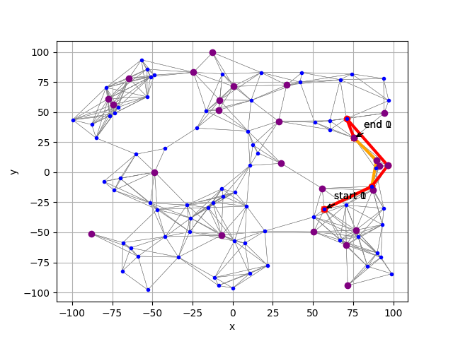

# The scripts

This README gives a brief overview about all provided scripts and their respective tasks. For even more detailed description on the code, please refer to the respective script itself

-------

### ! Important note !

The task-specific elements (only being <a href='cpp_backend/lib/src/Async_VI.cpp' target='_blank'>`Async_VI.cpp`</a>, <a href='cpp_backend/lib/inc/Async_VI.h' target='_blank'>`Async_VI.h`</a>, <a href='cpp_backend/main.cpp' target='_blank'>`main.cpp`</a> (only for testing purposes relevant eitherway) and <a href='async_vi.py' target='_blank'>`async_vi.py`</a>) can be easily replaced by other task-specific implementations. Only minor changes in <a href='cpp_backend/lib/inc/Interface.h' target='_blank'>`Interface.h`</a>, <a href='backend/compile_interface.py' target='_blank'>`compile_interface.py`</a> and <a href='backend/backend_cpp.py' target='_blank'>`backend_cpp.py`</a> + <a href='backend/backend_py.py' target='_blank'>`backend_py.py`</a> are needed. The respective changes can be easily comprehended by taking a brief study on theses scripts.

  

-------

## <a href='backend/' target='_blank'>`backend/`</a>

holds all files that are responsible for the `Python/C++` interface from python side

  

-------

## <a href='cpp_backend/' target='_blank'>`cpp_backend/`</a>

holds complete `C++` backend, including <a href='cpp_backend/main.cpp' target='_blank'>`main.cpp`</a> that can be used for testing the `C++` code (independently from `Python` or the `CFFI Interface`)

  

-------

## <a href='data/' target='_blank'>`data/`</a>

contains all datasets that are provided with the repository

  

-------

## <a href='tests/' target='_blank'>`tests/`</a>

contains all testfiles that get called by `make test` in <a href='Makefile' target='_blank'>`Makefile`</a>

  

-------

## <a href='async_vi.py' target='_blank'>`async_vi.py`</a>

### !needs to be completely replaced for different task!
Script to calculate the policy via C++ with bigger datasets and comparing the result with the given one in the `datasets`

Given functionality:
- `run()` - runs the code. Loads the data and performs the `Async VI` in `C++`. Afterwards the result gets plotted, comparing the calculated `policy` with the calculated `A*` path

  

<h2 align="center">
  
</h2>

  

-------

## <a href='data_demonstration.py' target='_blank'>`data_demonstration.py`</a>

### !needs to be completely replaced for different task!
gets called by <a href='async_vi.py' target='_blank'>`async_vi.py`</a>. Is responsible for plotting calculated `policy` and calculated `A*` path

Given functionality:
- `state_to_tuple()` - casts state to tuple with fuel, goal star and current star
- `state_from_tuple()` - casts tuple with fuel, goal star and current star to state
- `jump()` - performs a jump from star to star
- `travel()` - calculates the path for given `policy` and `state`
- `path_to_coor()` - casts path to coordinates
- `plot_full_graph()` - plots given path (either `A*` or `policy`)
- `load_sparse_matrix()` - load sparse matrix data from given directory
- `to_sparse_matrix()` - makes scipy.sparse.csr_matrix from given parameters 

  

-------

## <a href='graphsearch.py' target='_blank'>`graphsearch.py`</a>

### !needs to be completely replaced for different task!
Implements the `A*` algorithm 

Given functionality:
- `_a_star_heuristic()` - implements the `A*` distance norm
- `_a_star_reconstruct_path()` - reconstructs the travelled path
- `_a_star_neighbours()` - calculates distances to all neighbors
- `a_star_edge_cost()` - set a cost for travelling to a star, default = 1
- `a_star()` - main implementation of `A*`, calls all above functions

  

-------

## <a href='Makefile' target='_blank'>`Makefile`</a>

Makefile for this folder.

Given functionality:
- `make clean` - cleans project folder by removing old executables, `tar`-archives and further folders, calls `remove_pycharm` and `remove_srcfiles`. Calls `make clean` in <a href='backend/' target='_blank'>`backend/`</a>, <a href='cpp_backend/' target='_blank'>`cpp_backend/`</a> and <a href='tests/' target='_blank'>`tests/`</a>
- `make compile` - deletes old executables, `tar`-archives and further folders and recompiles full project by calling `make compile` in <a href='cpp_backend/' target='_blank'>`cpp_backend/`</a>
- `make test` - runs `pytest` in <a href='tests/' target='_blank'>`tests/`</a>. Tests whether `cpp_backend` was succesfully compiled and is in use. Furthermore it tests whether the result of `cpp_backend` leads to the same results as provided in the respective `data` folder (in this case <a href='src/data/data_debug' target='_blank'>`data_debug/`</a>)
- `remove_interface` - removes the interface files by calling `make remove_interface` in <a href='backend/' target='_blank'>`backend/`</a>
- `remove_pycharm` - removes pycache folders [`.idea/` and `__pycache__/`]
- `remove_srcfiles` - removes pycache folders [`.pytest_cache/` and `.idea/`]